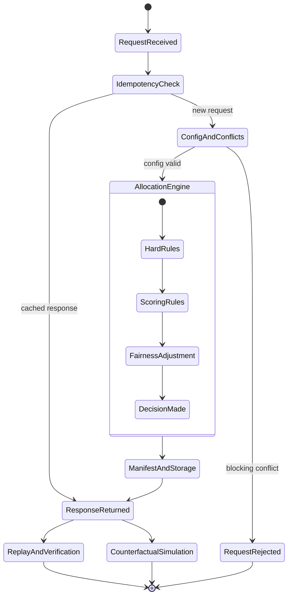

# Rule-Driven Allocation Engine Prototype

A focused prototype implementing five novel capabilities for auditable, deterministic allocation decisions:

1. **Sealed Decision Manifest (SDM)**: each allocation run emits a tamper-evident manifest with canonical trace hash, input hash, config hash, conflict report hash, and HMAC signature.
2. **Counterfactual Simulation**: run what-if analysis against historical decisions by mutating rules/weights/toggles/partner pool.
3. **Gini-Adaptive Fairness Enforcement**: monitor rolling load inequality and dynamically escalate fairness scoring weight when Gini exceeds threshold.
4. **Rule Conflict Detection**: detect logical, weight, and dependency conflicts before evaluation starts.
5. **Deterministic Replay**: replay historical decisions from stored inputs+config and prove identical trace hash.

## Stack

- FastAPI
- Pydantic v2
- SQLite + SQLAlchemy (sync)
- Python stdlib `hmac` + `hashlib`
- pytest
- structlog
- PyYAML

## Project Layout

```text
allocation-prototype/
├── src/allocation/
│   ├── domain/
│   ├── rules/
│   ├── engine/
│   ├── fairness/
│   ├── simulation/
│   ├── persistence/
│   ├── config/
│   └── api/
├── demo/
├── tests/
├── README.md
└── pyproject.toml
```

## Major Components

- `API`: accepts allocation requests and exposes manifest, replay, and simulation endpoints.
- `Config + Conflict Detection`: loads `rules.yaml`, validates rule setup, and blocks broken configs.
- `Rule Engine`: applies hard rules first, then scoring rules, and picks the best partner deterministically.
- `Fairness Layer`: tracks recent partner load and can raise fairness weight when allocation becomes too uneven.
- `Manifest + Persistence`: stores the sealed decision manifest, input snapshot, config version, and allocation events.
- `Replay + Simulation`: verifies past decisions, reproduces them deterministically, and runs what-if scenarios.

## Small State Diagram

This is a simple project-level view that shows only the main parts of the allocation flow.



### How To Read This Diagram

- `RequestReceived` and `IdempotencyCheck` are the API entry points.
- `ConfigAndConflicts` represents config loading and pre-run rule validation.
- `AllocationEngine` is the core decision path: filter with hard rules, score candidates, apply fairness, then choose a partner.
- `ManifestAndStorage` means the result is sealed, saved, and linked to its input/config history.
- `ReplayAndVerification` and `CounterfactualSimulation` are post-decision capabilities built on stored history.

## Verified Local Workflow

Use the project-local virtual environment for every command below. The repository currently validates cleanly with `.venv/bin/python`, while the system `python` on this machine may not have `pytest`, `sqlalchemy`, `structlog`, or other runtime dependencies on `PATH`.

Optional shell shortcut:

```bash
cd allocation-prototype
source .venv/bin/activate
```

Exact commands validated in this repository:

```bash
.venv/bin/python -m pytest -v
.venv/bin/python demo/demo_sdm.py
.venv/bin/python demo/demo_counterfactual.py
.venv/bin/python demo/demo_fairness.py
.venv/bin/python demo/demo_conflict.py
.venv/bin/python demo/demo_replay.py
.venv/bin/python demo/demo_scenario_compare.py
.venv/bin/python scripts/prepare_zomato_data.py \
  --input ../Zomato\ Dataset.csv \
  --audit-out demo/zomato_audit_report.json \
  --payload-out demo/zomato_allocation_payload.json \
  --max-orders 120 \
  --max-partners 80
.venv/bin/alembic upgrade head
```

If `.venv` is missing on your machine, create it and install dependencies before running the validated commands:

```bash
cd allocation-prototype
python -m venv .venv
source .venv/bin/activate
pip install -e '.[dev]'
```

## Run API (No Version Prefix)

```bash
.venv/bin/python -m uvicorn allocation.api.app:app --reload
```

Endpoints:

- `POST /allocations`
- `GET /allocations/diagnostics/latest`
- `GET /allocations/{order_id}/manifest`
- `GET /allocations/{order_id}/manifest/verify`
- `GET /allocations/{order_id}/replay`
- `GET /allocations/{order_id}/rejection-summary`
- `GET /allocations/{order_id}/trace`
- `POST /simulations`
- `GET /health`

`POST /allocations` requires header `X-Idempotency-Key`.

## Verified Validation Results

The current repository state was re-checked with the project-local `.venv` after the diagnostics, API-testability, and migration work:

- Tests: `.venv/bin/python -m pytest -v` -> `22 passed`
- Demos: SDM, replay, fairness, conflict detection, and counterfactual all completed successfully
- Zomato audit: `45,584` rows and `1,320` unique delivery partners
- Refreshed generated payload: `120` orders and `80` partners
- Scenario comparison on the refreshed payload:
  - baseline exact: `53` allocated / `67` unallocated
  - relaxed distance: `86` allocated / `34` unallocated
  - compatibility-enabled default: `67` allocated / `53` unallocated
- Direct route-function API validation now covers allocation, idempotency, manifest fetch, manifest verify, replay, and rejection summaries
- Alembic migrations upgraded cleanly on a fresh SQLite database

## Run Demos

```bash
.venv/bin/python demo/demo_sdm.py
.venv/bin/python demo/demo_counterfactual.py
.venv/bin/python demo/demo_fairness.py
.venv/bin/python demo/demo_conflict.py
.venv/bin/python demo/demo_replay.py
.venv/bin/python demo/demo_scenario_compare.py
```

## Run Migrations

```bash
.venv/bin/alembic upgrade head
```

## Use The Zomato CSV As Real-World Seed Data

The file `../Zomato Dataset.csv` is a useful real-world proxy for this project. It has real delivery-style features (geo points, traffic/weather/festival context, delivery times), but it includes noise that must be cleaned before use.

Known quality issues detected by audit:

- Missing values (`NaN`) in ratings, age, city, traffic, and order time.
- Coordinate sign bug on a subset of rows (restaurant latitude/longitude negative while delivery coordinate is positive).
- A small set of outliers (invalid age/rating and extreme route distance).

Run the adapter to audit and produce a cleaned allocation payload:

```bash
.venv/bin/python scripts/prepare_zomato_data.py \
  --input ../Zomato\ Dataset.csv \
  --audit-out demo/zomato_audit_report.json \
  --payload-out demo/zomato_allocation_payload.json \
  --max-orders 120 \
  --max-partners 80
```

Use generated payload directly with the API:

```bash
curl -X POST http://127.0.0.1:8000/allocations \
  -H 'Content-Type: application/json' \
  -H 'X-Idempotency-Key: zomato-seed-001' \
  --data @demo/zomato_allocation_payload.json
```

### Demo to Claim Mapping

- `demo/demo_sdm.py` -> Claim: cryptographically sealed, tamper-evident decision record.
- `demo/demo_counterfactual.py` -> Claim: historical what-if simulation with rule mutation and trace diff.
- `demo/demo_fairness.py` -> Claim: live inequality monitoring that changes scoring behavior.
- `demo/demo_conflict.py` -> Claim: pre-run contradiction detection and activation blocking.
- `demo/demo_replay.py` -> Claim: deterministic replay proof via trace hash identity.
- `demo/demo_scenario_compare.py` -> Claim: product decision support for hard-rule strictness changes.

## Tests

```bash
.venv/bin/python -m pytest -v
```

## Notes

- Config is loaded from `src/allocation/config/rules.yaml`.
- Broken config for conflict demo: `src/allocation/config/rules_broken.yaml`.
- SDM signing key is read from `SDM_SIGNING_KEY` (defaults to `dev-signing-key`).
- Bottom-to-top quality guide: `docs/SYSTEM_QUALITY_GUIDE.md`.
- Agent notes and intentional out-of-scope items: `AGENT_NOTES.md`.
- Simple validation summary: `VALIDATION_SUMMARY.md`.
- Latest feature report: `RUN_REPORT_2026-03-30.md`.
- Historical runtime report: `RUN_REPORT_2026-03-21.md`.
